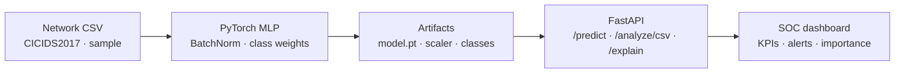

# SOC Lite · AI intrusion detection

> Train a detector. Serve it behind FastAPI. Watch a SOC console score live traffic.

A company-style **ML + API + dashboard** loop for network intrusion detection — not a notebook that stops at accuracy.

<p align="center">
  <a href="https://ai-cyber-threat-dashboard-1.onrender.com/"><strong>▶ Live SOC</strong></a>
  &nbsp;·&nbsp;
  <a href="https://ai-cyber-threat-dashboard-1.onrender.com/docs"><strong>API / Swagger</strong></a>
</p>

[](https://github.com/Ananyanagaraj11/soc-lite-ai-ids)


---

Analysts do not want another CSV. They want **who is attacking, how sure the model is, and which features drove the call**. SOC Lite trains a PyTorch MLP on CICIDS2017 / UNSW-NB15 (or the bundled 3k-row sample), ships the artifact behind FastAPI, and renders KPIs, severity, and feature importance in a SOC console.



## What to click

| Surface | What you should notice |
|---------|------------------------|
| [Live demo](https://ai-cyber-threat-dashboard-1.onrender.com/) | Upload CSV → attack %, threat level, timeline |
| `/predict/explain` | Feature importance, not a black box |
| `/analyze/csv` | Batch scoring with actual vs predicted |
| `/docs` | Production-shaped REST, not a hidden Flask app |

**Stack:** PyTorch · scikit-learn · FastAPI · pandas · Plotly.js · Docker · Render

## Sample data

| File | Rows | Features | Mix |
|------|------|----------|-----|
| [`data/sample_data.csv`](data/sample_data.csv) | 3,000 | `f1`–`f20` | 1,819 Normal · 1,181 Attack |

```bash
python scripts/generate_sample_data.py
python training/train.py --data data/sample_data.csv
curl -X POST "http://localhost:8000/analyze/csv" -F "file=@data/sample_data.csv"
```

## Quick start

```bash
git clone https://github.com/Ananyanagaraj11/soc-lite-ai-ids.git
cd soc-lite-ai-ids
pip install -r requirements.txt
python -m uvicorn backend.app:app --host 0.0.0.0 --port 8000
```

Open [http://localhost:8000](http://localhost:8000) · try `data/sample_data.csv`.

Train on CICIDS2017 (optional):

```bash
python training/train.py --data data/CICIDS2017 --use-cicids2017-dir --max-rows-total 50000
scripts\copy_artifacts.bat
```

## Model

- **Architecture:** Input → 128 → 64 (BatchNorm + Dropout) → classes
- **Loss:** CrossEntropy with class weights · **Opt:** Adam
- **Preprocess:** StandardScaler, label encode, balanced splits
- **Explain:** feature importance on `/predict/explain`

## API

| Method | Path | Role |
|--------|------|------|
| GET | `/health` | Readiness |
| GET | `/config` | `input_dim`, class names |
| POST | `/predict` | One vector |
| POST | `/predict/explain` | Prediction + importance |
| POST | `/analyze/csv` | Batch file |
| GET | `/api/last-analysis` | Last batch |

## Repo map

```
backend/app.py              FastAPI + static SOC
backend/explain.py          Feature importance
training/train.py          PyTorch MLP
dashboard/                 KPIs, charts, alerts
data/sample_data.csv       3k-row demo
```

## Interview line

> SOC Lite is how I ship an ML model as a service. Train a detector, freeze artifacts, expose FastAPI, and put a SOC console on top so an analyst sees severity and *why* — not a raw softmax.

---

**Ananya Naga Raj** · [GitHub](https://github.com/Ananyanagaraj11) · MIT
